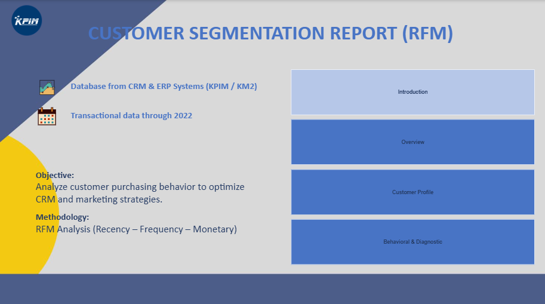
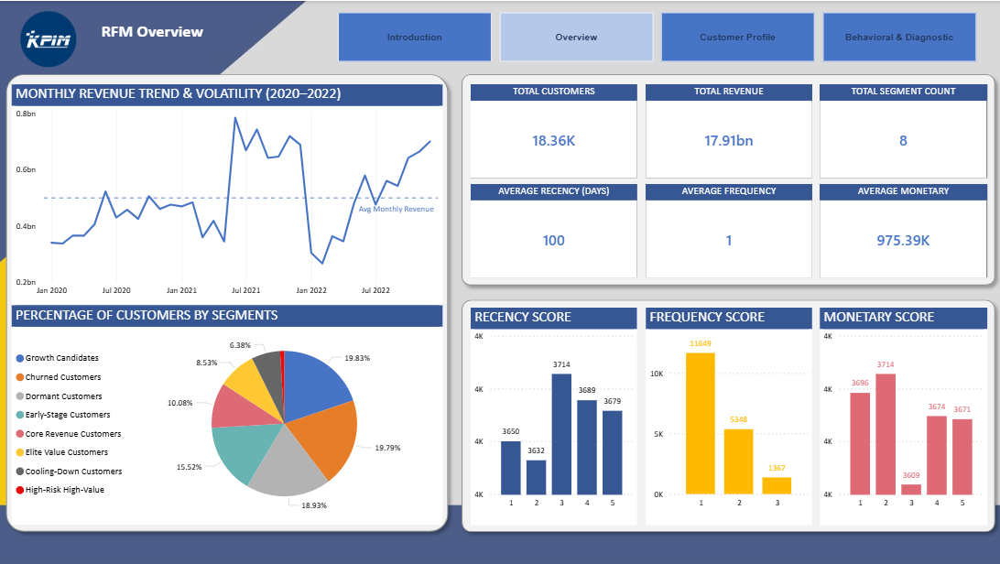
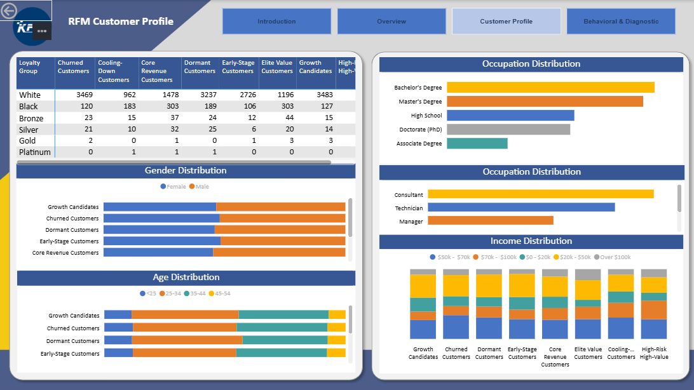
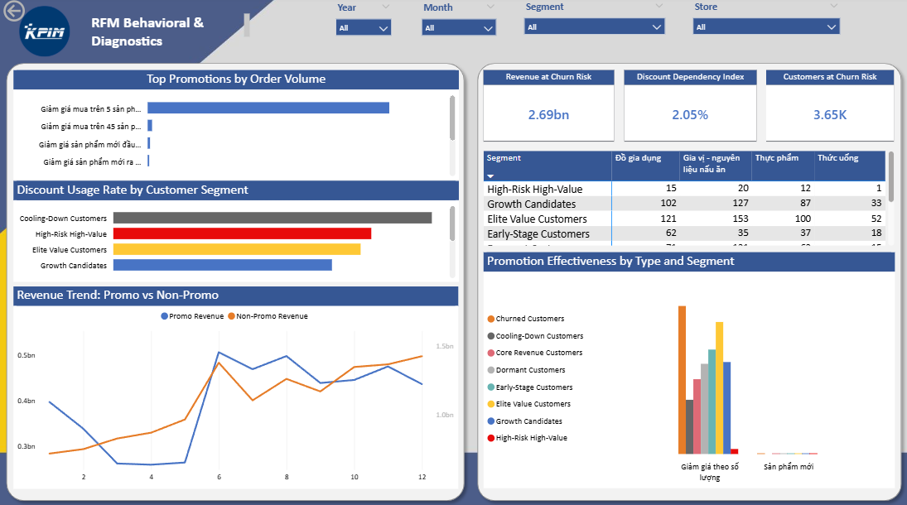

# Customer Segmentation Dashboard (RFM Analysis)

## Overview
This project presents a 3-page Power BI dashboard that analyzes customer behavior using RFM (Recency, Frequency, Monetary) methodology. The goal is to segment customers, evaluate churn risk, and support data-driven CRM and marketing strategies.

---

## Objective
- Understand customer purchasing behavior
- Identify high-value and at-risk customer segments
- Support targeted marketing and retention strategies

---

## Dataset
- Source: CRM & ERP systems (KPIM / KM2)
- Transactional data up to 2022
- Includes customer transactions, revenue, and behavioral attributes

---

## Tools & Techniques
- Power BI
- Power Query (data cleaning and transformation)
- DAX (calculated measures and KPIs)
- RFM Analysis (Recency, Frequency, Monetary)

---

## Dashboard Structure

### 1. Overview
- Monthly revenue trend and volatility (2020–2022)
- Key KPIs:
  - Total customers: 18.36K
  - Total revenue: 17.91bn
  - Average recency: 100 days
  - Average frequency: 1
  - Average monetary: 975.39K
- Customer distribution across segments

### 2. Customer Profile
- Customer segmentation by loyalty groups (e.g., high-value, churned, dormant)
- Demographic analysis:
  - Gender distribution
  - Age distribution
  - Income distribution
  - Occupation breakdown
- Segment-level behavioral patterns

### 3. Behavioral & Diagnostic Analysis
- Promotion effectiveness by customer segment
- Discount usage patterns across segments
- Revenue comparison: promotional vs non-promotional
- Churn risk metrics:
  - Revenue at churn risk: 2.69bn
  - Customers at risk: 3.65K
  - Discount dependency index: 2.05%

---

## Key Insights

- Revenue shows volatility across periods, indicating unstable performance trends  
- A significant portion of customers falls into mid- to low-engagement segments  
- High-value customers contribute disproportionately to total revenue  
- Customers at churn risk represent a large revenue exposure  
- Discount-heavy strategies are linked to certain segments, suggesting dependency  

---

## Business Recommendations

- Prioritize retention strategies for high-value and at-risk customers  
- Reduce over-reliance on discounts by improving value propositions  
- Develop targeted campaigns based on customer segments  
- Focus on increasing purchase frequency for low-engagement segments  

---

## Features
- Interactive filters (time, segment, store)
- Dynamic KPIs and segment-level metrics
- Drill-down capabilities across dashboard pages
- Multi-page analytical storytelling (Overview → Profile → Diagnostics)

---

## Promotional Playbook
A 13-slide follow-up deck that turns the dashboard's segments into a spend plan: which of the 8 RFM segments to grow with perks, which to win back and in what order, and four fixes to how promotions are planned and measured. It also documents a confirmed bug in the dashboard's own churn-risk filter (a segment name mismatch that undercounts at-risk customers by 1,171, 4,818/4.05bn actual vs. 3.65K/2.69bn shown) along with three other measurement gaps to fix before trusting the KPI cards above.

- [Download Promotional Playbook (GitHub)](https://github.com/linhnguye237/linh-nguyen-portfolio/blob/main/projects/powerbi-customer-analysis/RFM_Promotional_Playbook.pptx)

---

## Files
- [Download DashBoard (GitHub)](https://github.com/linhnguye237/linh-nguyen-portfolio/blob/main/projects/powerbi-customer-analysis/RFM_Updated_2.pbix)
- [Download Promotional Playbook (GitHub)](https://github.com/linhnguye237/linh-nguyen-portfolio/blob/main/projects/powerbi-customer-analysis/RFM_Promotional_Playbook.pptx)

## Dashboard Preview

---

## Status
Completed 

