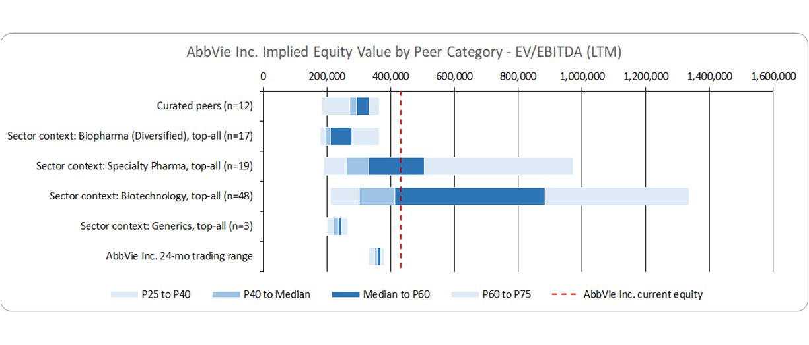
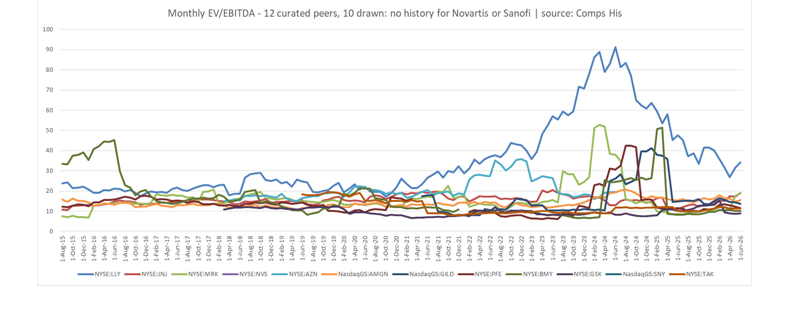

# Listed Comparables Automation (Python)

## Overview
This project rebuilds a comparable company valuation workbook, the deliverable analysts use to value a
company against its publicly traded peers, using only free public data. The process is normally manual
and depends on a paid market data terminal. Here it runs as one Python command that takes a stock
ticker and produces a formatted 8-tab Excel workbook.

Four companies have been run through the pipeline end to end, across three industries and two
continents.

---

## Objective
- Reproduce a paid terminal deliverable using only free public sources
- Replace a manual, multi-day process with one repeatable command
- Keep an analyst in control of the two steps that require judgement
- Report gaps in the data instead of filling them in

---

## Dataset
- Source: SEC EDGAR (XBRL company facts and annual report text), Wikidata, Yahoo Finance
- An index of 8,004 US filers, plus a worldwide company layer built from Wikidata
- About 39 financial metrics per company
- 131 month-ends of valuation history per company
- All sources are free and public. No paid market data subscription is used anywhere in the pipeline.

---

## Tools & Techniques
- Python (pandas, requests, openpyxl, Excel COM): 179 modules, about 37,000 lines
- Financial analysis (enterprise value, EV/EBITDA, EV/Sales, P/E, EBITDA margin, gross margin, revenue
  CAGR, operating and free cash flow)
- XBRL parsing (restatement handling, exact tag selection, per-company EBITDA routing)
- API integration (REST and SPARQL)
- Data modeling (layered caching, append-only record store, entity identity resolution)
- LLM-assisted classification (25 business characteristics per company, supporting quote required)
- Excel automation (writing into a live template without breaking its formulas, charts or styles)
- Automated testing (31 acceptance checks behind one command)

---

## Methodology

1. Identify the Company
- Resolve the ticker to a single company worldwide and select its primary listing
- Build a profile: industry, geography, business segments and business description

2. Define the Screening Criteria (analyst step)
- An analyst writes the rules that define a comparable peer for this company
- A strict linter confirms every rule is valid before anything runs

3. Build and Screen the Candidate Universe
- Screen US filers and a worldwide stream from Wikidata against those criteria
- Judge every candidate against every criterion and record the result
- Rank the companies that survive

4. Approve the Peer Set (analyst step)
- The analyst approves the final peer list and may override the ranking
- Every override is recorded with a written reason, the author and the date

5. Populate the Workbook
- Pull about 39 metrics for each company and write them into the workbook
- Build 131 months of point-in-time valuation history
- Run 31 automated checks on the result

The pipeline has 14 stages: 12 automatic and 2 analyst checkpoints. It stops at the first thing it
needs and prints exactly what to produce. Re-running resumes where it stopped.

---

## Workbook Structure
Eight tabs, generated for any ticker, keeping the template's 20,092 formulas, both charts and all
formatting:

1. Summary: filterable peer table with statistics (max, min, average, median, percentiles)
2. Football Field: implied equity value by peer category
3. Comps: the peer grid with every metric
4. Comps His: 131 month-ends of EV/EBITDA, EV/Sales and P/E
5. Screen Criteria: the rules used to define a peer
6. Screening: the funnel from full universe down to the final peer set
7. Criteria Matrix: every candidate scored against every criterion
8. Mapping: field and label definitions

The valuation history is point-in-time. Every figure for a given month uses only what had been filed by
that month-end, so a 2018 multiple is never calculated from a 2022 restatement.

---

## Results by Company
- AbbVie (US pharmaceuticals): the reference build. Screening funnel of 8,004 filers, to 804 in scope,
  to 765 screened. The finished workbook regenerates from an empty template plus its own 109,778 values.
- Old Dominion (US trucking): screened to 62 US motor freight companies from its own criteria, with no
  code changes
- Deutsche Post DHL (Germany): no SEC filings and no US listing. Produced 369 candidates, 62 judged, a
  final peer set of 18, and 131 months of history. 22 incorrect ticker matches were caught and refused.
- Nestlé (Switzerland): screening criteria assembled automatically for the first time, followed by a
  ranking of 17 candidates

---

## Key Insights

- The full deliverable can be produced from free public data, with two gaps that are disclosed rather
  than estimated
- Screening worldwide rather than US-only roughly quadruples the candidate pool. DHL produced 369
  candidates across 38 countries.
- Data coverage matters more than ranking method. Across 990 companies, revenue is available for 482,
  five-year growth for 194, EBITDA growth for 1, and revenue mix for none. No formula improves on a
  missing input.
- Company identity is the highest-risk step, not the financial calculations. Matching on ticker alone
  attributed 3M's $25bn of revenue to a German meal-kit company, because a ticker is only unique within
  one exchange.
- A US industry code cannot classify a foreign company. Screening on SIC code alone dropped 158 of 240
  candidates for having no SIC code at all. Naming a second classification scheme dropped none.
- Results generalize across industries and countries. Pharmaceuticals, trucking and logistics all
  screened correctly with no code changes.

---

## Business Impact

- Removes a paid market data subscription from the comparables workflow
- Reduces the work per company from several days to roughly two hours of analyst time
- Makes the peer list defensible. Peers come from written rules, never from a typed list of names, and
  every analyst override carries a recorded reason and date.
- Makes the deliverable reproducible. The workbook regenerates from its underlying data, so any figure
  can be traced back to the filing it came from.

---

## Features
- One command per company, resumable if it is interrupted
- Worldwide company screening, not limited to US filers
- Interactive filters in the workbook (region, type, growth type) with statistics that recalculate
- Point-in-time valuation history across 131 month-ends
- Two analyst checkpoints, with overrides recorded
- Deterministic runs. Every stage reads frozen data and live access is opt-in, so a re-run gives the
  same answer.
- 31 automated checks behind a single command

---

## Limitations
- Forward-looking estimates are not available in free data and stay blank
- Monthly history is drawn from SEC filings, so non-US peers have gaps. 6 of DHL's 18 peers have none.
- Writing the screening criteria and approving the final peer set still need an analyst

---

## Files
The pipeline runs in a private repository, as it holds a workbook template and cached filings. A code
walkthrough is available on request.

---

## Dashboard Preview

Implied equity value by peer category, compared against the company's current equity value. The title,
categories and axis scale all follow the subject company, so the chart is not fixed to one industry.

Monthly EV/EBITDA across 131 month-ends. The title states that 10 of the 12 peers are drawn and names
the two with no history, rather than drawing a line through data that does not exist.

---

## Status
Working, 4 companies run end to end. In progress of automating the two analyst steps.
